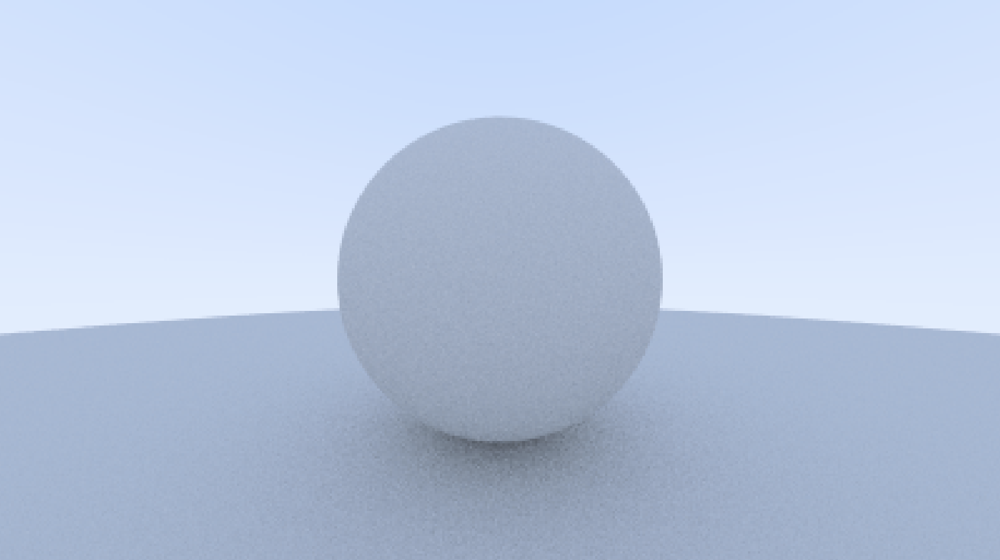
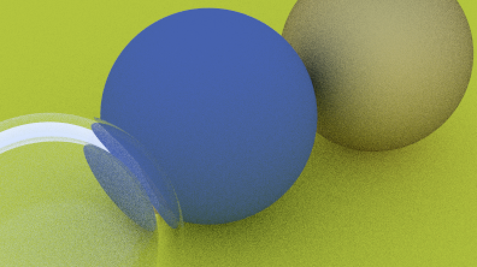

# Helios: A Raytracer in C++

**Helios** is a C++ pathtracing and raytracing project that aims to simulate realistic light interactions within a 3D scene. It follows the core concepts of ray tracing, allowing for accurate reflections, refractions, shadows, and other lighting phenomena to create photorealistic images.

Loosely adapted from Peter Shirley's _Ray Tracing in One Weekend_, **Helios** implements key raytracing features, including:

- **Ray-Sphere Intersections**: Efficient detection of intersections between rays and spherical objects.
- **Surface Normals**: Accurate calculation of normals for shading and light reflection.
- **Antialiasing**: Reduction of aliasing artifacts for smoother images.
- **Diffuse Materials**: Simulation of matte, non-reflective surfaces.
- **Metal**: Realistic reflections for metallic surfaces.
- **Dielectrics (Glass and Metal)**: Simulations of transparent materials such as glass, including both refraction and reflection.
- **Positionable Camera**: A camera that can be dynamically positioned to capture scenes from various angles and perspectives.
- **Depth of Field / Defocus Blur**: Simulation of realistic camera focus effects, including blurring objects outside the focal range.

## Build and Run

To build and run **Helios**, follow these steps:

```bash
cmake -B build
cmake --build build
build/helios > images/sample.ppm
```

This will generate an image (`sample.ppm`) as the output of the raytracing process. You can customize the scene parameters within `main.cpp`.

## Gallery

### Surface Normal and Lighting Test



### Reflections and Refractions



### Complex Scene


## Acknowledgements

**Helios** draws inspiration from the following works:

- **Shirley, Peter, et al.** _Ray Tracing in One Weekend_. First edition, 2024.
- **Möller, Tomas, et al.** _Real-Time Rendering_. Fourth edition, CRC Press, Taylor and Francis Group, 2018.
- **Marschner, Steve, and Peter Shirley.** _Fundamentals of Computer Graphics_. Fourth edition, CRC Press, Taylor & Francis Group, 2016.
- **Hughes, John F.** _Computer Graphics: Principles and Practice_. Third edition, Addison-Wesley, 2014.
